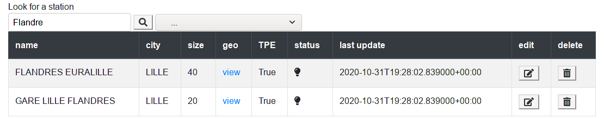
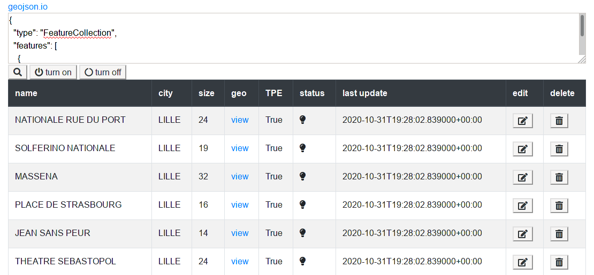
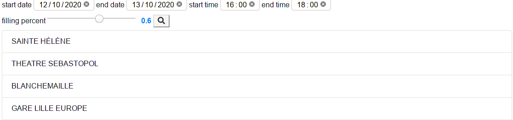

 # Self-services Bicycle

Write 4 programs in python and mongo

1. Get self-services Bicycle Stations (geolocations, size, name, tpe, available): Lille, Lyon, Paris and Rennes
2. Worker who refresh and store live data for a city (history data)
3. User program: give available stations name next to the user lat, lon with last data (bikes and stand)
4. Business program:
    1. find station with name (with some letters)
    2. update a stations
    3. delete a station and datas
    4. deactivate all station in an area
    5. give all stations with a ratio bike/total_stand under 20% between 18h and 19h00 (monday to
        friday)

The flask server can be used easily

```bash
cd flask_server
python3 server.py
```


## Testing (known working) exemples

Flandre for the stations




GeoJson data

```json
{
  "type": "FeatureCollection",
  "features": [
    {
      "type": "Feature",
      "properties": {},
      "geometry": {
        "type": "Polygon",
        "coordinates": [
          [
            [
              3.044414520263672,
              50.62828552300783
            ],
            [
              3.059864044189453,
              50.623711785516775
            ],
            [
              3.0699062347412105,
              50.631388877217056
            ],
            [
              3.061237335205078,
              50.63656067901137
            ],
            [
              3.0498218536376953,
              50.63421982868815
            ],
            [
              3.044414520263672,
              50.62828552300783
            ]
          ]
        ]
      }
    }
  ]
}
```




Date and percentage filling 

